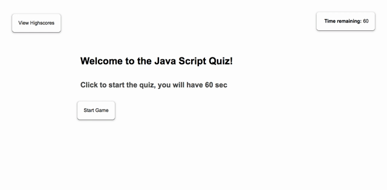

# JS-Quiz
***
Title: Java Script Quiz
***
Description: A browser based quiz that asks a user multiple choice questions and records the time taken
***
Purpose: Understanding the use of Java Script opperations and traversing the DOM. This knowledge can be used to adapt third party API's for personal use. 
***
Ideal execution: Time is deducted for incorrect answers and the quiz ends when all questions are answered. When the quiz ends, the users score (time remaining) is recorded to local storage along with their initals via a form.
***
Actual fuction:  Time is deducted for incorrect answers and the quiz ends when all questions are answered. When the quiz ends, the time remaining ceases, however it fails to record to local storage. The user's input into the results form is also failed to be recored to local storage. 
The highscores button does not execute any fuction.

Because of the large and complex JS code (much of it executed via brute force, not clean simple fucntions), there is a lag in the internal results calculations and the results screen takes a second to load.
***
Deployment: When the HTML, CSS and JS files are displayed by any browser the code should appear as indicated by this example image: 
The page can also be access via the folowing url: https://wollemipines.github.io/JS-Quiz/
***
Changes: None, this is the first edtion. 
